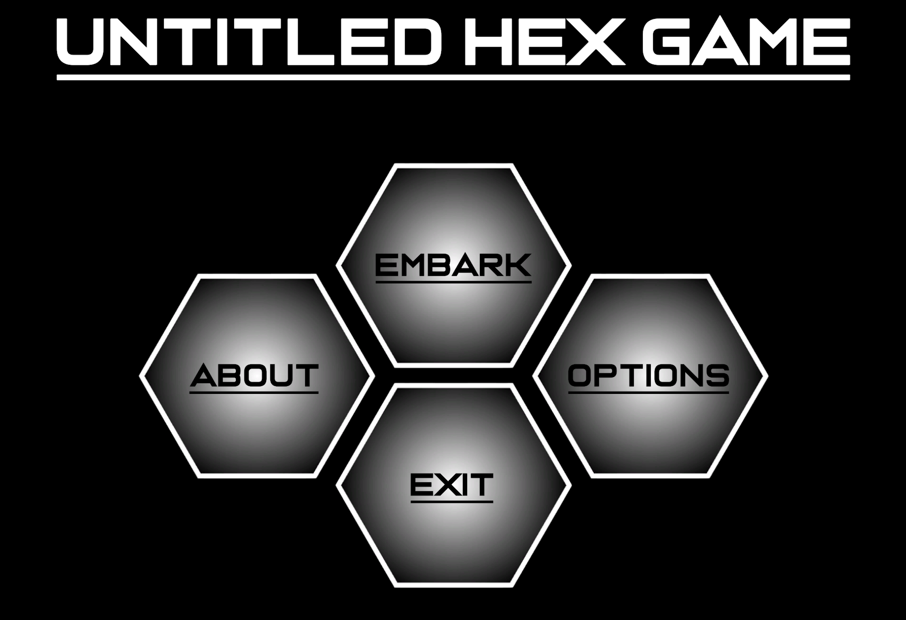
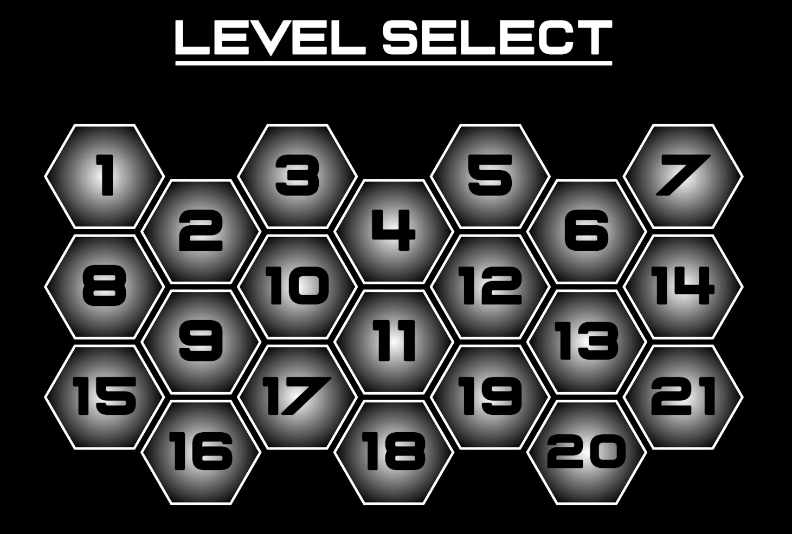
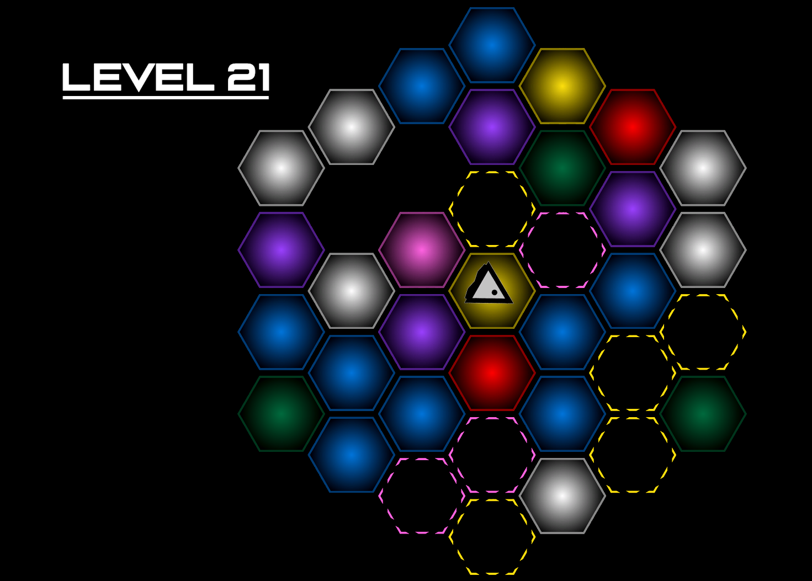

# Untitled Hex Game

A minimalist puzzle game about working through surprising interactions of different colored tiles

---

## Gameplay Overview

- **To Play:** Move the player by selecting an adjacent tile ...or not.
- **Goal:** Reach every key (green) tile to solve each puzzle.
- **Twist:** Each tile behaves differently based on color, player interactions, and spatial logic.

---

- Unity, C# 

##  Credits

- Game design, art, and code by David Kohn
- Thanks to Ben Aronson for game design and inspiration
- Music by Dylan Lewis
- Inspired by games like *Baba Is You*, *Stephen’s Sausage Roll*, and *The Witness*
